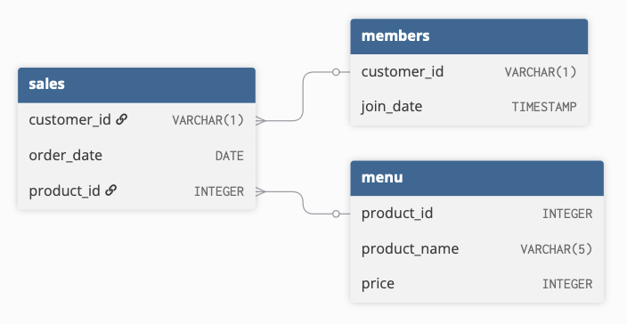

# 🍽️ Danny’s Diner SQL Case Study


Danny wants to use data to better understand his customers, including their visiting patterns, spending behavior, and favorite menu items.

## Datasets
- `sales`
- `menu`
- `members`

## ERD


---

### 1) What is the total amount each customer spent at the restaurant?

```sql
SELECT 
  sales.customer_id, 
  SUM(menu.price) AS total_amount
FROM sales 
JOIN menu 
  ON sales.product_id = menu.product_id
GROUP BY sales.customer_id
ORDER BY sales.customer_id;
```
#### Steps:

- Combine `sales` and `menu` to attach prices to each purchase.  
- Sum item prices to compute total spend per customer.  
- Group by `customer_id` to aggregate results at the customer level.  
- Order results for readability.  

| customer_id | total_amount |
|-------------|--------------|
| A           | 76           |
| B           | 74           |
| C           | 36           |
- Customer A spent $76
- Customer B spent $74
- Customer C spent $36

### 2) How many days has each customer visited the restaurant?
```sql
SELECT 
  customer_id, 
  COUNT(DISTINCT order_date) AS total_visits
FROM sales
GROUP BY customer_id;
```
#### Steps:

- Count distinct `order_date` values to capture unique visit days.  
- Use `COUNT(DISTINCT order_date)` to avoid counting multiple purchases on the same day.  
- Group by `customer_id` to calculate visits per customer.  

| customer_id |total_visits|
|------------|-------------|
| A          | 4           |
| B          | 6           |
| C          | 2           |
- Customer A has had 4 visits
- Customer B has had 6 visits
- Customer C has had 2 visits

### 3) What was the first item from the menu purchased by each customer?

```sql
SELECT DISTINCT
  customer_id, 
  product_name AS first_order
FROM (
  SELECT 
    sales.customer_id,
    menu.product_name,
    RANK() OVER (
      PARTITION BY sales.customer_id 
      ORDER BY sales.order_date
    ) AS rn
  FROM sales 
  JOIN menu  
    ON sales.product_id = menu.product_id
) x
WHERE rn = 1;
```
#### Steps:

- Join `sales` and `menu` to associate each purchase with its item name.  
- Use `RANK()` to order purchases by `order_date` for each customer.  
- Partition by `customer_id` so rankings reset for each customer.  
- Filter for `rn = 1` to keep only the earliest purchase(s).
 
| customer_id | first_order |
|-------------|--------------|
| A           | curry        |
| A           | sushi        |
| B           | curry        |
| C           | ramen        |
- Customer A simulatenously ordered curry and sushi first
- Customer B ordered curry first
- Customer C ordered ramen first

### 4) What is the most purchased item on the menu and how many times was it purchased by all customers?
```sql
SELECT 
  menu.product_name, 
  COUNT(sales.product_id) AS most_purchased
FROM sales
JOIN menu 
  ON sales.product_id = menu.product_id
GROUP BY menu.product_name
ORDER BY most_purchased DESC
LIMIT 1;
```
#### Steps:

- Join `sales` and `menu` to map each purchase to its item name.  
- Count purchases per item using `COUNT(sales.product_id)`.  
- Group by `product_name` to aggregate totals for each menu item.  
- Order results in descending order to identify the most purchased item.  
- Use `LIMIT 1` to return only the top result.  

| product_name |most_purchased|
|------------|-------------|
| ramen          | 8           |
- The most purchased item on the menu is ramen and it was ordered 8 times

### 5) Which item was the most popular for each customer?
```sql
WITH popular AS (
  SELECT
    sales.customer_id,
    menu.product_name,
    COUNT(*) AS order_count,
    RANK() OVER (
      PARTITION BY sales.customer_id
      ORDER BY COUNT(*) DESC
    ) AS rank
  FROM sales
  JOIN menu 
    ON sales.product_id = menu.product_id
  GROUP BY 
    sales.customer_id, 
    menu.product_name
)

SELECT 
  customer_id, 
  product_name, 
  order_count
FROM popular
WHERE rank = 1;
```
#### Steps:

- Join `sales` and `menu` to associate each purchase with its item name.  
- Count purchases per item for each customer using `COUNT(*)`.  
- Use `RANK()` partitioned by `customer_id` to rank items by popularity.  
- Order by purchase count in descending order to identify top items.  
- Filter for `rank = 1` to return each customer’s most popular item(s).  

| customer_id | product_name |order_count|
|-------------|--------------|--------------|
| A           | curry        |       3      |
| B           | sushi        |       2      |
| B           | curry        |       2      |
| B           | ramen        |       2      |
| C           | ramen        |       3      |
- Customer A ordered curry the most, on 3 occasions.
- Customer B ordered sushi, curry, and ramen the most, 2 times each.
- Customer C ordered ramen the most, on 3 occasions.

### 6) Which item was purchased first by the customer after they became a member?
```sql
WITH member_first_order AS (
  SELECT
    members.customer_id, 
    sales.product_id,
    sales.order_date,
    members.join_date,
    ROW_NUMBER() OVER (
      PARTITION BY members.customer_id
      ORDER BY sales.order_date
    ) AS row_num
  FROM members
  JOIN sales
    ON members.customer_id = sales.customer_id
   AND sales.order_date > members.join_date
)

SELECT 
  customer_id, 
  product_name
FROM member_first_order
JOIN menu 
  ON member_first_order.product_id = menu.product_id
WHERE row_num = 1
ORDER BY customer_id;
```
#### Steps:

- Join `members` and `sales` to link purchases with membership start dates.  
- Filter for orders placed after `join_date` to consider only post-membership activity.  
- Use `ROW_NUMBER()` partitioned by `customer_id` to order purchases chronologically.  
- Select `row_num = 1` to capture the first purchase after becoming a member.  
- Join with `menu` to retrieve the corresponding item name.  

| customer_id | product_name |
|-------------|--------------|
| A           | ramen        |
| B           | sushi        |
- Customer A ordered ramen first after becoming a member
- Customer B ordered sushi first after becoming a member

### 7) Which item was purchased just before the customer became a member?
```sql
WITH member_first_order AS (
  SELECT
    members.customer_id, 
    sales.product_id,
    sales.order_date,
    members.join_date,
    ROW_NUMBER() OVER (
      PARTITION BY members.customer_id
      ORDER BY sales.order_date DESC
    ) AS row_num
  FROM members
  JOIN sales
    ON members.customer_id = sales.customer_id
   AND sales.order_date < members.join_date
)

SELECT 
  customer_id, 
  product_name
FROM member_first_order
JOIN menu 
  ON member_first_order.product_id = menu.product_id
WHERE row_num = 1
ORDER BY customer_id;
```
#### Steps:

- Join `members` and `sales` to align purchases with membership dates.  
- Filter for orders placed before `join_date` to capture pre-membership activity.  
- Use `ROW_NUMBER()` partitioned by `customer_id` and ordered descending by `order_date`.  
- Select `row_num = 1` to get the most recent purchase before becoming a member.  
- Join with `menu` to retrieve the corresponding item name.

| customer_id | product_name |
|-------------|--------------|
| A           | sushi        |
| B           | sushi        |

- Customer A ordered sushi just before becoming a member
- Customer B also ordered sushi just before becoming a member
This might mean that sushi incentivized these customers to sign up!

### 8) What is the total items and amount spent for each member before they became a member?
```sql
SELECT 
  sales.customer_id, 
  COUNT(sales.product_id) AS total_items, 
  SUM(menu.price) AS total_sales
FROM sales
JOIN members
  ON sales.customer_id = members.customer_id 
 AND sales.order_date < members.join_date
JOIN menu
  ON sales.product_id = menu.product_id
GROUP BY sales.customer_id
ORDER BY sales.customer_id;
```
#### Steps:

- Join `sales` and `members` to align purchases with membership start dates.  
- Filter for orders placed before `join_date` to capture pre-membership activity.  
- Join with `menu` to bring in item prices.  
- Count purchases using `COUNT(sales.product_id)` to get total items.  
- Sum prices using `SUM(menu.price)` to calculate total spend.  
- Group by `customer_id` to aggregate results per customer.  

| customer_id | total_items  | total_sales|
|-------------|--------------|------------|
| A           | 2            | 25         |    
| B           | 3            | 40         |   
- Customer A purchased 2 items and spent $25 before becoming a member
- Customer B purchased 3 items and spent $40 before becoming a member

### 9) If each $1 spent equates to 10 points and sushi has a 2x points multiplier - how many points would each customer have?
```sql
WITH points AS (
  SELECT 
    menu.product_id,
    CASE
      WHEN product_id = 1 THEN price * 20
      ELSE price * 10
    END AS points
  FROM menu
)

SELECT 
  sales.customer_id, 
  SUM(points.points) AS total_points
FROM points
JOIN sales 
  ON sales.product_id = points.product_id
GROUP BY sales.customer_id
ORDER BY total_points DESC;
```
#### Steps:

- Create a CTE to assign point values per item based on pricing rules.  
- Use a `CASE` statement to apply a 2x multiplier for sushi and standard points for other items.  
- Join the calculated points with `sales` to map points to each transaction.  
- Sum points per customer using `SUM(points.points)`.  
- Group by `customer_id` to get total points per customer.  
- Order results to compare highest point earners.
 
| customer_id | total_points |
|-------------|--------------|
| B           | 940          |
| A           | 860          |
| C           | 360          |
- Customer B has the most points, at 940 points
- Customer A has 860 points
- Customer C has 360 points

### 10) In the first week after a customer joins the program (including their join date) they earn 2x points on all items, not just sushi - how many points do customer A and B have at the end of January?
```sql
WITH dates AS (
  SELECT 
    customer_id,
    join_date, 
    join_date + 6 AS valid_date, 
    '2021-01-31'::date AS last_date
  FROM members
)

SELECT 
  sales.customer_id, 
  SUM(
    CASE
      WHEN menu.product_name = 'sushi' THEN 2 * 10 * menu.price
      WHEN sales.order_date BETWEEN dates.join_date AND dates.valid_date THEN 2 * 10 * menu.price
      ELSE 10 * menu.price 
    END
  ) AS points
FROM sales
JOIN dates 
  ON sales.customer_id = dates.customer_id
 AND sales.order_date >= dates.join_date
 AND sales.order_date <= dates.last_date
JOIN menu 
  ON sales.product_id = menu.product_id
GROUP BY sales.customer_id
ORDER BY points DESC;
```

#### Steps:

- Create a CTE to define each member’s `join_date`, bonus period end date, and the January cutoff date.  
- Join `sales` with the membership date table to keep only purchases made after joining and before the end of January.  
- Join with `menu` to bring in product names and prices.  
- Use a `CASE` statement to apply double points for sushi and for all items purchased during the first week of membership.  
- Sum the calculated points for each customer.  
- Group by `customer_id` to return total points per member.  

| customer_id | points |
|-------------|--------------|
| A           | 1020        |
| B           | 320        |
- Customer A has 1020 points
- Customer B has 320 points


